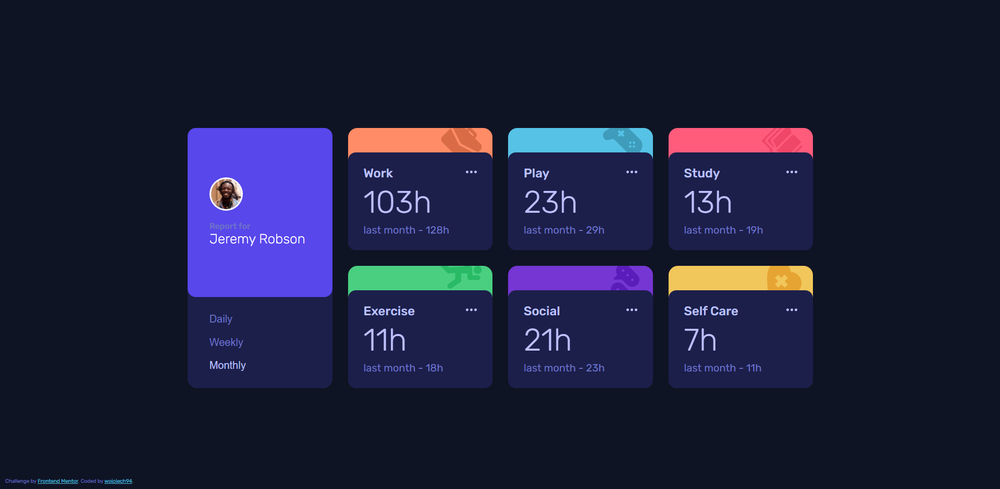

# Frontend Mentor - Time tracking dashboard solution

This is a solution to the [Time tracking dashboard challenge on Frontend Mentor](https://www.frontendmentor.io/challenges/time-tracking-dashboard-UIQ7167Jw).

## Table of contents

- [Overview](#overview)
  - [The challenge](#the-challenge)
  - [Screenshot](#screenshot)
  - [Links](#links)
- [Author](#author)
- [My process](#my-process)
  - [Built with](#built-with)
  - [What I learned](#what-i-learned)

## Overview

### The challenge

Users should be able to:

- View the optimal layout for the site depending on their device's screen size
- See hover states for all interactive elements on the page
- Switch between viewing Daily, Weekly, and Monthly stats

### Screenshot

### Links

- Solution URL: [Solution URL](https://github.com/wojciech94/Time-Tracking-Dashboard)
- Live Site URL: [Live site URL](https://wojciech94.github.io/Time-Tracking-Dashboard/)

## Author

- Website - [Wojciech94](https://github.com/wojciech94)
- Frontend Mentor - [@wojciech94](https://www.frontendmentor.io/profile/wojciech94)

## My process

### Built with

- Semantic HTML5 markup
- CSS
- SCSS
- JS
- Flexbox layout
- Grid layout
- Mobile-first workflow
- RWD
- JSON data fetch

### What I learned

In this challenge I:
-Improved knowledge of css grid layout
-Learnt how to fetching JSON data in javascripts
